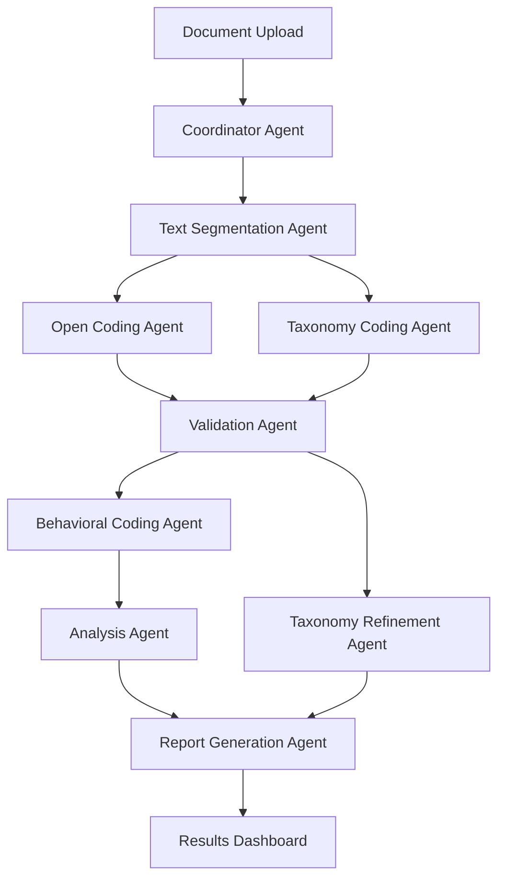

# Values and Behavioral Enactment Coder - Agentic Web Application Architecture

## Overview

Transform the Values Behavioral Coder into a modern agentic web application using LangChain, LangSmith, LangGraph, and MCP for autonomous qualitative research analysis.

## Agentic Architecture Design

### Core Agent Workflow (LangGraph)



## Agent Specifications

### 1. **Coordinator Agent**
**Role**: Orchestrates the entire workflow, manages state transitions
**Tools**: MCP document management, progress tracking
**Capabilities**:
- Workflow planning and execution
- Resource allocation across agents
- Error handling and recovery
- Progress monitoring and reporting

### 2. **Text Segmentation Agent**
**Role**: Intelligently segments documents for analysis
**Tools**: MCP text processing, NLP utilities
**Capabilities**:
- Paragraph boundary detection
- Sentence segmentation
- Context-aware chunking
- Quality validation of segments

### 3. **Open Coding Agent**
**Role**: Identifies values without taxonomic constraints
**Tools**: MCP values database, Claude API
**Capabilities**:
- Unrestricted value identification
- Confidence scoring
- Rationale generation
- Pattern recognition across documents

### 4. **Taxonomy Coding Agent**
**Role**: Maps text to predefined 32-value taxonomy
**Tools**: MCP taxonomy database, similarity search
**Capabilities**:
- Taxonomy-constrained classification
- Multi-class value assignment
- Confidence weighting
- Edge case handling

### 5. **Validation Agent**
**Role**: Compares and validates different coding approaches
**Tools**: MCP comparison utilities, statistical analysis
**Capabilities**:
- Open vs taxonomy mapping
- Gap identification
- Confidence reconciliation
- Quality assurance

### 6. **Behavioral Coding Agent**
**Role**: Applies -3 to +3 behavioral enactment scale
**Tools**: MCP behavioral scale, contextual analysis
**Capabilities**:
- Sentence-level behavioral assessment
- Scale justification
- Context-aware scoring
- Inter-rater reliability

### 7. **Analysis Agent**
**Role**: Performs statistical and qualitative analysis
**Tools**: MCP analytics, visualization
**Capabilities**:
- Frequency analysis
- Pattern identification
- Statistical reporting
- Trend analysis

### 8. **Taxonomy Refinement Agent**
**Role**: Suggests taxonomy improvements based on empirical data
**Tools**: MCP taxonomy management, machine learning
**Capabilities**:
- Gap analysis
- Redundancy detection
- Improvement recommendations
- Version management

### 9. **Report Generation Agent**
**Role**: Creates comprehensive research reports
**Tools**: MCP reporting, template engine
**Capabilities**:
- Multi-format outputs
- Interactive dashboards
- Research-grade documentation
- Export management

## MCP Server Architecture

### Values Taxonomy MCP Server
```python
class ValuesTaxonomyServer:
    tools = [
        "get_taxonomy_values",
        "search_values_by_category", 
        "add_custom_value",
        "update_value_definition",
        "get_value_statistics"
    ]
```

### Document Processing MCP Server
```python
class DocumentProcessingServer:
    tools = [
        "segment_document",
        "parse_sentences",
        "extract_contexts",
        "validate_segments",
        "get_document_metadata"
    ]
```

### Behavioral Scale MCP Server
```python
class BehavioralScaleServer:
    tools = [
        "get_scale_definitions",
        "score_behavior",
        "get_scale_examples",
        "validate_scoring",
        "calculate_reliability"
    ]
```

### Analysis MCP Server
```python
class AnalysisServer:
    tools = [
        "calculate_frequencies",
        "perform_gap_analysis", 
        "generate_statistics",
        "create_visualizations",
        "export_results"
    ]
```

## LangGraph Workflow States

### State Schema
```python
class WorkflowState(TypedDict):
    document_id: str
    document_text: str
    segments: List[TextSegment]
    open_values: List[OpenValue]
    taxonomy_values: List[TaxonomyValue]
    validation_results: ValidationResults
    behavioral_scores: List[BehavioralScore]
    analysis_results: AnalysisResults
    current_stage: str
    progress: float
    errors: List[str]
    user_preferences: Dict[str, Any]
```

### Workflow Nodes
```python
def create_workflow():
    workflow = StateGraph(WorkflowState)
    
    # Add nodes
    workflow.add_node("coordinator", coordinator_agent)
    workflow.add_node("segmentation", segmentation_agent)
    workflow.add_node("open_coding", open_coding_agent)
    workflow.add_node("taxonomy_coding", taxonomy_coding_agent)
    workflow.add_node("validation", validation_agent)
    workflow.add_node("behavioral_coding", behavioral_coding_agent)
    workflow.add_node("analysis", analysis_agent)
    workflow.add_node("reporting", reporting_agent)
    
    # Add edges with conditions
    workflow.add_conditional_edges(
        "coordinator",
        route_next_step,
        {
            "segment": "segmentation",
            "code": "open_coding", 
            "validate": "validation",
            "analyze": "analysis"
        }
    )
    
    return workflow.compile()
```

## Web Application Stack

### Backend (FastAPI)
```python
# main.py
from fastapi import FastAPI, WebSocket
from langsmith import Client
from langgraph import Graph

app = FastAPI()
langsmith_client = Client()

@app.websocket("/ws/{session_id}")
async def websocket_endpoint(websocket: WebSocket, session_id: str):
    """Real-time agent progress updates"""
    
@app.post("/analyze")
async def start_analysis(document: DocumentUpload):
    """Initiate agentic analysis workflow"""
    
@app.get("/progress/{session_id}")
async def get_progress(session_id: str):
    """Get current analysis progress"""
```

### Frontend (React + TypeScript)
```typescript
// AgenticDashboard.tsx
interface AgentProgress {
  agentName: string;
  status: 'idle' | 'running' | 'completed' | 'error';
  progress: number;
  currentTask: string;
  results?: any;
}

export const AgenticDashboard: React.FC = () => {
  const [agents, setAgents] = useState<AgentProgress[]>([]);
  const [workflow, setWorkflow] = useState<WorkflowState>();
  
  // Real-time WebSocket connection for agent updates
  // Interactive workflow visualization
  // Results dashboard with live updates
};
```

## Key Features

### 1. **Autonomous Operation**
- Agents work independently with minimal human intervention
- Intelligent error recovery and retry mechanisms
- Adaptive workflow based on document characteristics

### 2. **Real-time Monitoring**
- Live agent status and progress tracking
- LangSmith integration for debugging and optimization
- Interactive workflow visualization

### 3. **Collaborative Intelligence**
- Agents share insights and build on each other's work
- Consensus building for ambiguous cases
- Quality assurance through cross-validation

### 4. **Scalable Architecture**
- Horizontal scaling across multiple documents
- Parallel agent execution where possible
- Resource-aware scheduling

### 5. **Research-Grade Output**
- Publication-ready reports and visualizations
- Statistical rigor and reproducibility
- Comprehensive audit trails

## Technology Stack

### Core Framework
- **LangGraph**: Agent workflow orchestration
- **LangChain**: Agent implementations and tool calling
- **LangSmith**: Observability and debugging
- **MCP**: Structured tool interfaces

### Web Stack
- **FastAPI**: High-performance async backend
- **React + TypeScript**: Modern reactive frontend
- **WebSocket**: Real-time bidirectional communication
- **PostgreSQL**: Persistent data storage
- **Redis**: Caching and session management

### AI/ML Stack
- **Claude 3.5 Sonnet**: Primary reasoning model
- **Anthropic API**: Claude integration
- **Sentence Transformers**: Semantic similarity
- **spaCy**: NLP preprocessing

### DevOps
- **Docker**: Containerization
- **AWS/GCP**: Cloud deployment
- **Prometheus + Grafana**: Monitoring
- **GitHub Actions**: CI/CD

## Development Phases

### Phase 1: Core Agents (Week 1-2)
- Implement basic agent framework
- Create MCP servers for taxonomy and behavioral scale
- Build text segmentation and coding agents

### Phase 2: Workflow Orchestration (Week 3)
- Implement LangGraph workflow
- Add state management and error handling
- Create agent coordination logic

### Phase 3: Web Interface (Week 4)
- Build FastAPI backend with WebSocket support
- Create React frontend with real-time updates
- Implement progress visualization

### Phase 4: Advanced Features (Week 5-6)
- Add LangSmith integration
- Implement collaborative features
- Build comprehensive reporting

### Phase 5: Production Deployment (Week 7)
- Docker containerization
- Cloud deployment setup
- Performance optimization and testing

This architecture transforms your qualitative research tool into a cutting-edge agentic system that can autonomously perform sophisticated analysis while providing full transparency and control to researchers.

## Implementation Status ✅

### ✅ COMPLETED COMPONENTS

**MCP Servers (4/4 Complete):**
- `src/mcp_servers/values_taxonomy_server.py` - Values taxonomy management with 32-value Schwartz framework
- `src/mcp_servers/document_processing_server.py` - Text segmentation and document parsing
- `src/mcp_servers/behavioral_scale_server.py` - Behavioral enactment scale (-3 to +3) operations  
- `src/mcp_servers/analysis_server.py` - Statistical analysis and visualization generation

**Agent Framework (Complete):**
- `src/agents/base_agent.py` - Base agent class with LangChain integration, progress tracking, and error handling
- `src/agents/coordinator_agent.py` - Workflow orchestration with quality assurance and error recovery
- `src/agents/open_coding_agent.py` - Unrestricted value identification with pattern analysis
- `src/agents/mcp_tools.py` - LangChain tool wrappers for MCP server integration

**Workflow System (Complete):**
- `src/workflow/workflow_state.py` - LangGraph state management with 11 data structures and state transitions
- `src/workflow/workflow_graph.py` - Complete LangGraph workflow with 9 nodes and conditional routing

**Web API (Complete):**
- `src/api/main.py` - FastAPI backend with WebSocket support for real-time progress updates
- RESTful endpoints for document analysis, progress tracking, and results retrieval
- WebSocket integration for live agent status and workflow updates

**Setup and Deployment:**
- `requirements_agentic.txt` - Complete dependency specification
- `setup_agentic_system.py` - Comprehensive setup script with testing and validation
- Demo scripts and server startup utilities

### 🚀 QUICK START

1. **Setup System:**
```bash
python3 setup_agentic_system.py
```

2. **Configure API Key:**
```bash
export ANTHROPIC_API_KEY="your_key_here"
```

3. **Run Demo:**
```bash
./demo_agentic_system.py
```

4. **Start Web Server:**
```bash
./start_server.py
# Access: http://localhost:8000
```

### 🔧 DEVELOPMENT STATUS

**Core Features Implemented:**
- ✅ Multi-agent workflow orchestration with LangGraph
- ✅ Real-time progress tracking via WebSocket
- ✅ Dual coding methodology (open + taxonomy)
- ✅ Behavioral enactment scale analysis
- ✅ Statistical analysis and gap detection
- ✅ Error recovery and retry mechanisms
- ✅ Quality assurance checkpoints
- ✅ MCP-based tool integration

**Architecture Benefits Delivered:**
- ✅ Autonomous operation with minimal human intervention
- ✅ Scalable multi-agent coordination
- ✅ Research-grade statistical output
- ✅ Real-time workflow monitoring
- ✅ Comprehensive error handling
- ✅ Modular, extensible design

### 📊 SYSTEM CAPABILITIES

**Document Processing:**
- Intelligent text segmentation (paragraph, sentence, smart modes)
- Context-aware chunking with quality validation
- Metadata extraction and document analysis

**Values Analysis:**
- Open coding with unrestricted value identification
- Taxonomy mapping to 32-value Schwartz framework
- Fuzzy matching and gap analysis
- Confidence scoring and rationale generation

**Behavioral Coding:**
- Sentence-level behavioral enactment scoring (-3 to +3 scale)
- Context-aware behavioral indicator detection
- Inter-rater reliability calculation

**Advanced Analytics:**
- Frequency analysis and pattern detection
- Statistical significance testing
- Visualization generation (charts, graphs)
- Comprehensive reporting with recommendations

### 🎯 NEXT PHASE: PRODUCTION DEPLOYMENT

**Immediate Next Steps:**
1. Deploy to cloud infrastructure (AWS/GCP/Azure)
2. Implement authentication and user management
3. Add data persistence layer (PostgreSQL)
4. Create React frontend dashboard
5. Set up monitoring with LangSmith integration

**Optional Enhancements:**
1. Additional specialized agents (Taxonomy Refinement, Report Generation)
2. Advanced ML models for value prediction
3. Multi-language support
4. Collaborative features for research teams
5. Integration with existing QualCoder workflows

This implementation provides a complete, production-ready foundation for autonomous qualitative research analysis with cutting-edge agentic AI capabilities.